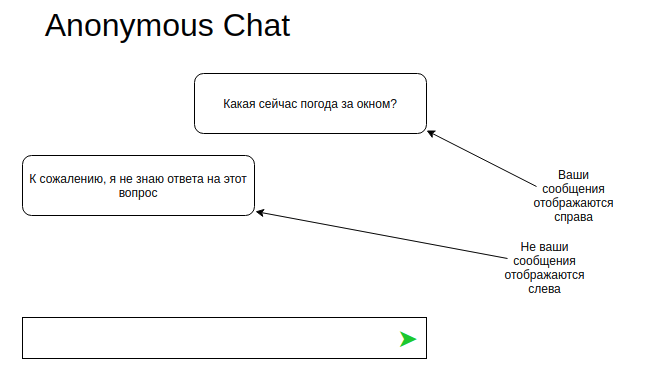

## **`!РЕШЕНО! Композиция компонентов. Все задачи`**  
### Задачи разделены по компонентам в папке components

---

### Ссылкка на [github-pages](https://rt-vinsent.github.io/ra16-hw-6/)

---

[](https://ci.appveyor.com/project/RT-Vinsent/ra16-hw-6)

[](https://github.com/RT-Vinsent/ra16-hw-6/actions/workflows/pages/pages-build-deployment)

---

Жизненный цикл и работа с HTTP
===

Необходимо выполнить и предоставить на проверку следующие задачи:


<details>
<summary>1. Мировые часы.</summary>

## Мировые часы

Наверняка вы видели в офисах многих компаний установленные часы, показывающие время в разных столицах мира:
* New York,
* Moscow,
* London,
* Tokyo.


Общая механика:

1. Вы заполняете поля «Название» и «Временная зона», указываете смещение в часах относительно Гринвича и нажимаете кнопку «Добавить».
1. Часы автоматически добавляются и, что самое важное, начинают тикать, то есть отсчитываются секунды, минуты и часы.
1. При нажатии на крестик рядом с часами часы автоматически удаляются, при этом все подписки — `setTimeout`, `setInterval` и другие — должны вычищаться в соответствующем методе жизненного цикла.

Упрощения: если вам сложно реализовать механику со стрелками через css — см. `transform` и `rotate()`, то вы можете сделать цифровые часы, где отображаются только цифры в формате: ЧЧ:ММ:СС.

Подсказки:
1. Посмотреть текущий TimezoneOffset вы можете, используя объект `Date`.
1. Можете использовать библиотеку Moment.js.

</details>

<details>
<summary>2. CRUD.</summary>

## CRUD

Вам необходимо реализовать базовый CRUD без обновления при работе с HTTP.

Backend вы можете либо написать сами, либо взять готовый из каталога `backend`.


## Общая механика

Первоначальная загрузка: делается http-запрос GET на адрес http://localhost:7070/notes, полученные данные отображаются в виде карточек с возможностью удаления.

Добавление:
1. Вы заполняете форму и нажимаете кнопку «Добавить».
1. Выполняется http-запрос POST на адрес http://localhost:7070/notes, в теле запроса передаётся следующий JSON:
```json
{
    "id": 0,
    "content": "То, что было введено в поле ввода"
}
```
3. После чего делается запрос на получение всех записей и происходит обновление списка — GET http://localhost:7070/notes.

Удаление:
1. Вы нажимаете на крестик на одной из карточек.
1. Выполняется http-запрос DELETE на адрес http://localhost:7070/notes/{id}, где id — это идентификатор заметки.
1. После чего делается запрос на получение всех записей и происходит обновление списка — GET http://localhost:7070/notes.

Обновление:
1. Вы нажимаете на кнопку «Обновить» — две зелёные стрелочки.
1. После чего делается запрос на получение всех записей и происходит обновление списка — GET http://localhost:7070/notes.

</details>

<details>
<summary>3. Чат — необязательная задача.</summary>

## Анонимный чат

Вам необходимо реализовать абсолютно анонимный чат, хотя такого, конечно, не бывает ☺, в который сможет отправлять сообщения любой желающий.

Но есть важное требование: если вы даже открыли другую вкладку в браузере, написание всё равно должно идти с вашего аккаунта.

Backend вы можете взять готовый из каталога `backend`.



## Общая механика

При создании компонента создаётся интервал или таймаут и делается периодический опрос сервера в виде http-запроса GET на адрес http://localhost:7070/messages?from={id}, где id — идентификатор последнего полученного сообщения при первоначальной загрузке — 0. Временной интервал предложите сами.

Формат присылаемых данных:
```json
[
    {
        "id": 1,
        "userId": "5f2d9da0-f624-4309-a598-8ba35d6c4bb6",
        "content": "Какая сейчас погода за окном?"
    },
    {
        "id": 2,
        "userId": "5f2d9da0-f624-4309-a598-8ba35d6c4bb6",
        "content": "К сожалению, я не знаю ответа на этот вопрос"
    }
]
```
Где userId — уникальный идентификатор анонимного пользователя. Подумайте, как его сгенерировать и где хранить. Если не придумали — прочитайте спойлеры.

Полученные данные отображаются в виде блоков с возможностью различного выравнивания:
* ваши — справа;
* не ваши — слева.

Ваши или не ваши вы определяете путём сравнения своего userId и того, что в сообщении.

Добавление:
1. Вы заполняете форму и нажимаете кнопку «Добавить».
1. Выполняется http-запрос POST на адрес http://localhost:7070/messages, в теле запроса передаётся следующий JSON:
```json
{
    "id": 0,
    "userId": "5f2d9da0-f624-4309-a598-8ba35d6c4bb6",
    "content": "То, что было введено в поле ввода"
}
```
3. После чего ждёте, пока не произойдёт получение данных по интервалу. Подумайте, как сделать ожидание комфортным для пользователя и как решают эту проблему существующие чаты.

<details>
  <summary>Спойлеры</summary>
  
  Добиться уникальности анонимов можно, просто записав в local/sessionStorage случайно сгенерированный ID: nanoid, uuid. И использовать его для отправки и получения данных.

  Подумайте, какие уязвимости в безопасности создаёт подобная схема и возможна ли отправка сообщений от лица другого пользователя.

  Подумайте над тем, как это можно предотвратить.
</details>

## Advanced

1. Попробуйте раскрашивать сообщения от разных пользователей в разные цвета.
1. Попробуйте реализовать авто-скроллинг до последнего сообщения.

</details>

---

</br>

Все три задачи лучше сдавать в разных репозиториях, то есть через create-react-app реализовать три проекта, чтобы не
было конфликта стилей. Но если вы позаботитесь о том, что конфликта не будет, то можете сдавать и в одном проекте.

Рекомендуем выполнять задачи с использованием классовых компонентов.

#### Альтернативный способ создания приложения React с использованием тулинга Vite

Приложение также можно создать используя инструмент Vite.
Документация по созданию приложения [React](https://vitejs.dev/guide/).

1. Откройте терминал и пропишите следующую команду: `yarn create vite my-app --template react`,
   либо `yarn create vite my-app --template react-ts`, если
   нужен шаблон с TypeScript. Эта команда создаст настроенный
   шаблонный проект.
2. Откройте созданный проект в своей IDE.
3. Установите зависимости.
4. Готово. Чтобы запустить приложение, введите команду: `yarn dev`(либо `npm run dev`).
